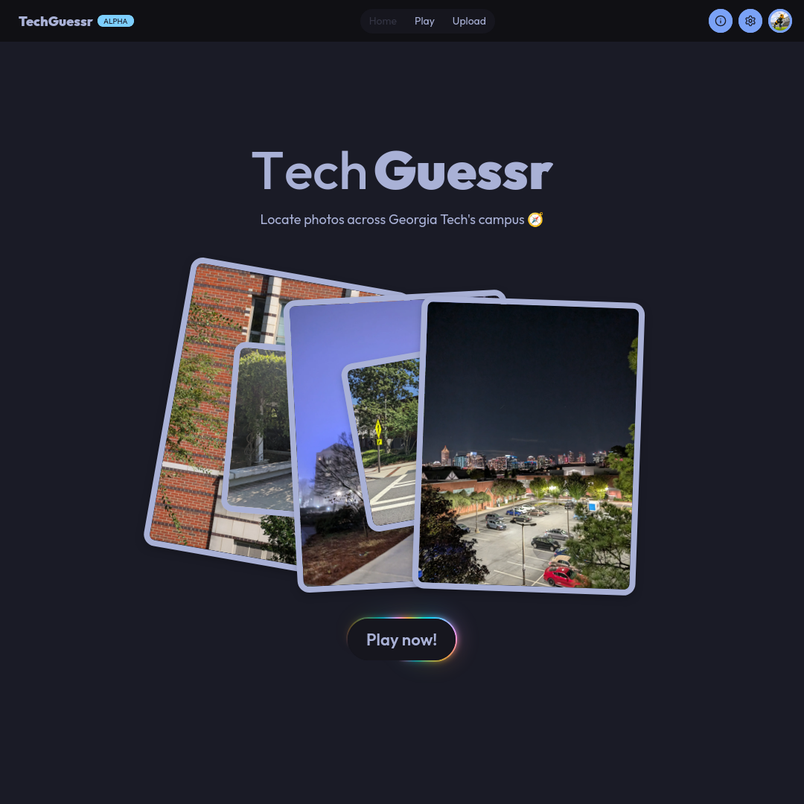

# TechGuessr



TechGuessr is a map game similar to GeoGuessr, but localized to the Georgia Tech campus in Atlanta.

Each game you receive 5 photos taken by someone on campus, and you have to guess where each one is by selecting a location on the map.

The closer you are, the more points you are awarded. A perfect round gives you 5,000 points, so a perfect game is 25,000 points.

Play now at [techguessr.com](https://techguessr.com)!

## Stack

- SvelteKit
- Supabase Auth + Storage
- Tailwind + daisyUI

## Development

- Clone the repo and install dependencies

```
git clone https://github.com/daqnal/techguessr.git
bun install
```

- Install the [Supabase CLI](https://supabase.com/docs/guides/local-development/cli/getting-started)
- Run `supabase start` and wait for Docker to download the whole internet
  - Ensure that the docker service is running on your system (`systemctl start docker` for SoystemD)
- Start the development server with `bun run dev`

## AI Disclosure

LLM's were used for writing and debugging code in the development process. Every line of code has been read and understood by a human.
